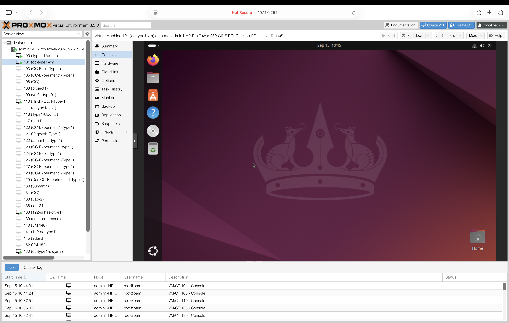
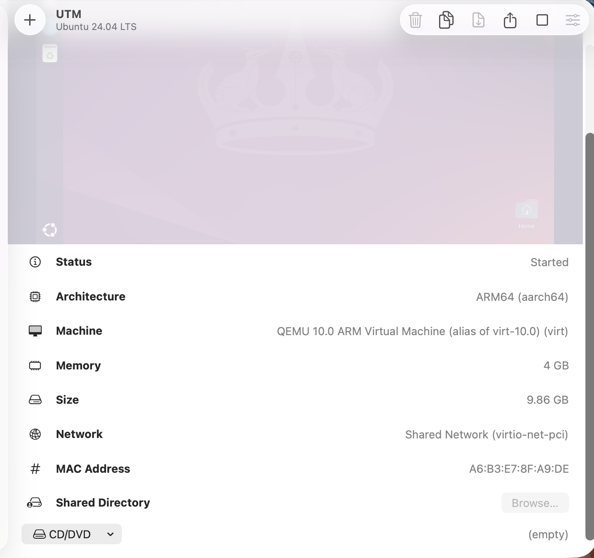

# Experiment 1: Hypervisor Analysis

## 1. Problem Statement

To study and analyze Type-1 and Type-2 hypervisors by creating and configuring virtual machines, understanding their architectures, verifying the virtualized environment, and performing basic CPU performance analysis.

The experiment uses **Proxmox VE** as the Type-1 hypervisor and **VMware Workstation** as the Type-2 hypervisor.

---

## 2. Objectives

1. To understand virtualization and the concept of hypervisors.
2. To study Type-1 and Type-2 hypervisor architectures.
3. To create and configure a virtual machine using Proxmox VE.
4. To create and configure a virtual machine using VMware Workstation.
5. To verify CPU, memory, and storage resources available to the virtual machine.
6. To perform CPU performance testing using Sysbench.
7. To record and compare the obtained performance and architectural characteristics.

---

## 3. Requirements

### Hardware

* Computer or server capable of supporting hardware virtualization.
* Sufficient CPU, RAM, and storage.
* Network connectivity where required.

### Software

| Software           | Purpose                |
| ------------------ | ---------------------- |
| Proxmox VE         | Type-1 Hypervisor      |
| VMware Workstation | Type-2 Hypervisor      |
| Ubuntu             | Guest Operating System |
| Sysbench           | CPU Benchmarking       |

---

## 4. Introduction to Hypervisors

A **hypervisor** is a software layer that enables multiple virtual machines to share the resources of a physical computer.

Hypervisors are broadly classified into two types.

### Type-1 Hypervisor

A Type-1 hypervisor runs directly on the physical hardware without requiring a conventional host operating system between the hardware and the hypervisor.

**Example used in this experiment:** Proxmox VE.

### Type-2 Hypervisor

A Type-2 hypervisor runs as an application on top of a host operating system and provides virtualization to guest virtual machines.

**Example used in this experiment:** VMware Workstation.

---

# 5. Architecture

## 5.1 Type-1 Hypervisor Architecture

```text
Physical Hardware
        ↓
    Proxmox VE
  (Type-1 Hypervisor)
        ↓
   Virtual Machine
        ↓
    Ubuntu OS
        ↓
Applications / Benchmark
```

In a Type-1 architecture, the hypervisor operates directly on the physical hardware and manages the virtual machines and their allocated resources.

---

## 5.2 Type-2 Hypervisor Architecture

```text
Physical Hardware
        ↓
  Host Operating System
        ↓
 VMware Workstation
  (Type-2 Hypervisor)
        ↓
   Virtual Machine
        ↓
    Ubuntu OS
        ↓
Applications / Benchmark
```

In a Type-2 architecture, the hypervisor runs as an application above the host operating system and provides virtualization to the guest virtual machine.

---

# 6. Type-1 Hypervisor — Proxmox VE

## 6.1 Introduction

Proxmox VE is used as the Type-1 hypervisor in this experiment.

An Ubuntu virtual machine is created and configured in the Proxmox environment. The VM configuration and system resources are verified.

## 6.2 Configuration

| Parameter              | Configuration |
| ---------------------- | ------------- |
| Hypervisor             | Proxmox VE    |
| Hypervisor Type        | Type-1        |
| Guest Operating System | Ubuntu        |
| Virtual Machine        | Ubuntu VM     |
| Benchmark Tool         | Sysbench      |

## 6.3 Procedure

1. Access the Proxmox VE environment.
2. Open the Proxmox web interface.
3. Create a new virtual machine.
4. Select the Ubuntu ISO image.
5. Allocate CPU, memory and storage resources.
6. Configure the network adapter.
7. Start the virtual machine.
8. Install Ubuntu.
9. Log in to the Ubuntu guest operating system.
10. Verify the allocated system resources.
11. Install and execute Sysbench.
12. Record the obtained results.

## 6.4 System Verification Commands

### CPU

```bash
lscpu
```

### Memory

```bash
free -h
```

### Storage

```bash
lsblk
```

```bash
df -h
```

### Operating System

```bash
hostnamectl
```

## 6.5 CPU Benchmark

The CPU benchmark can be performed using:

```bash
sysbench cpu --cpu-max-prime=20000 run
```

## 6.6 Type-1 Evidence

### Proxmox Dashboard


### Proxmox VM Configuration


### Ubuntu VM Running


### Ubuntu Console



These screenshots document the Type-1 virtualization environment, VM configuration and Ubuntu guest execution.

---

# 7. Type-2 Hypervisor — VMware Workstation

## 7.1 Introduction

VMware Workstation is used as the Type-2 hypervisor in this experiment.

An Ubuntu virtual machine is created and configured using VMware Workstation. The guest system configuration is verified.

## 7.2 Configuration

| Parameter              | Configuration      |
| ---------------------- | ------------------ |
| Hypervisor             | VMware Workstation |
| Hypervisor Type        | Type-2             |
| Host Operating System  | Windows            |
| Guest Operating System | Ubuntu             |
| Virtual Machine        | Ubuntu VM          |
| Benchmark Tool         | Sysbench           |

## 7.3 Procedure

1. Open VMware Workstation on the host operating system.
2. Create a new virtual machine.
3. Select the Ubuntu ISO image.
4. Configure the virtual CPU.
5. Allocate memory.
6. Configure the virtual disk.
7. Configure the network adapter.
8. Start the virtual machine.
9. Install Ubuntu.
10. Log in to the Ubuntu guest operating system.
11. Verify the system configuration.
12. Perform CPU benchmarking using Sysbench when the VMware environment is available.

## 7.4 System Verification Commands

```bash
hostnamectl
```

```bash
lscpu
```

```bash
free -h
```

```bash
lsblk
```

```bash
df -h
```

## 7.5 CPU Benchmark

The same benchmark command is used for a fair comparison:

```bash
sysbench cpu --cpu-max-prime=20000 run
```

## 7.6 Type-2 Evidence

### VMware VM Configuration



### VMware VM Running


### VMware System Configuration


These screenshots document the Type-2 virtualization environment, VMware VM configuration, VM execution and guest system configuration.

---

# 8. Type-1 vs Type-2 Hypervisor Comparison

| Feature              | Type-1 Hypervisor                              | Type-2 Hypervisor                                        |
| -------------------- | ---------------------------------------------- | -------------------------------------------------------- |
| Example Used         | Proxmox VE                                     | VMware Workstation                                       |
| Hypervisor Location  | Directly on physical hardware                  | Runs above a host operating system                       |
| Host OS Dependency   | Does not require a conventional host OS        | Requires a host operating system                         |
| Guest OS             | Ubuntu                                         | Ubuntu                                                   |
| Hardware Access      | More direct hardware access                    | Hardware access through the host OS                      |
| Performance Overhead | Generally lower                                | Generally higher due to host OS layer                    |
| Resource Management  | Hypervisor directly manages resources          | Resources are managed through the host OS and hypervisor |
| Isolation            | Strong VM isolation                            | VM isolation with host OS dependency                     |
| Typical Usage        | Servers, data centers and cloud infrastructure | Desktop virtualization, development and testing          |
| Example Platform     | Proxmox VE                                     | VMware Workstation                                       |
| Experiment Activity  | VM creation, configuration and verification    | VM creation, configuration and verification              |

---

# 9. Performance Analysis

The CPU benchmark is performed using Sysbench.

The same command should be used in both environments:

```bash
sysbench cpu --cpu-max-prime=20000 run
```

The main parameters that can be compared are:

| Parameter         | Type-1: Proxmox      | Type-2: VMware       |
| ----------------- | -------------------- | -------------------- |
| Total Time        | From Sysbench result | From Sysbench result |
| Total Events      | From Sysbench result | From Sysbench result |
| Events per Second | From Sysbench result | From Sysbench result |
| Average Latency   | From Sysbench result | From Sysbench result |

> The Type-2 benchmark values should be entered only from an actual VMware Sysbench result. No assumed values are used.

---

# 10. Result

The experiment successfully demonstrated the concepts of Type-1 and Type-2 virtualization.

### Type-1

Proxmox VE was used as the Type-1 hypervisor to create and run an Ubuntu virtual machine. The VM configuration and guest system resources were verified.

### Type-2

VMware Workstation was studied as the Type-2 hypervisor. The VMware virtual machine was configured and executed with Ubuntu as the guest operating system.

The comparison table demonstrates the architectural and operational differences between Type-1 and Type-2 hypervisors.

---

# 11. Conclusion

This experiment provided practical understanding of virtualization and hypervisors.

Type-1 virtualization was studied using **Proxmox VE**, while Type-2 virtualization was studied using **VMware Workstation**. Ubuntu was used as the guest operating system.

The experiment demonstrated virtual machine creation, configuration, resource verification and CPU benchmarking using Sysbench.

The comparison shows that Type-1 hypervisors operate directly on physical hardware, whereas Type-2 hypervisors depend on a host operating system. This makes Type-1 hypervisors more suitable for server and cloud environments, while Type-2 hypervisors are commonly useful for desktop virtualization, development and testing.

---

# 12. Reproducibility Guide

## Type-1 — Proxmox VE

1. Prepare a system capable of running Proxmox VE.
2. Access or install Proxmox VE.
3. Open the Proxmox web interface.
4. Create a new virtual machine.
5. Select an Ubuntu ISO.
6. Allocate CPU, memory, storage and network resources.
7. Install Ubuntu.
8. Log in to the guest operating system.
9. Verify the system using `hostnamectl`, `lscpu`, `free -h`, `lsblk` and `df -h`.
10. Install Sysbench.
11. Run the CPU benchmark.
12. Record the output.

## Type-2 — VMware Workstation

1. Prepare a system with VMware Workstation.
2. Open VMware Workstation.
3. Create a new virtual machine.
4. Select an Ubuntu ISO.
5. Allocate CPU, memory, storage and network resources.
6. Install Ubuntu.
7. Log in to the guest operating system.
8. Verify the system configuration.
9. Install Sysbench.
10. Run the same CPU benchmark.
11. Record the output.
12. Compare the result with the Type-1 environment.

---

# 13. Important Commands

## System Information

```bash
hostnamectl
```

```bash
lscpu
```

```bash
free -h
```

```bash
lsblk
```

```bash
df -h
```

## Sysbench

```bash
sudo apt update
```

```bash
sudo apt install sysbench -y
```

```bash
sysbench --version
```

```bash
sysbench cpu --cpu-max-prime=20000 run
```

---

# 14. Repository Structure

```text
01-Hypervisor-Analysis/
│
├── README.md
│
└── screenshots/
    │
    ├── type1/
    │   ├── 01-proxmox-dashboard.png
    │   ├── 02-proxmox-vm-configuration.png
    │   ├── 03-proxmox-vm-running.png
    │   └── 04-proxmox-ubuntu-console.png
    │
    └── type2/
        ├── 01-vmware-vm-configuration.png
        ├── 02-vmware-vm-running.png
        └── 03-vmware-system-configuration.png
```

---

# 15. Author

**Name:** Shreenidhi Dharwad

**Course:** Cloud Computing

**Institution:** KLE Technological University

**Academic Year:** 2026
