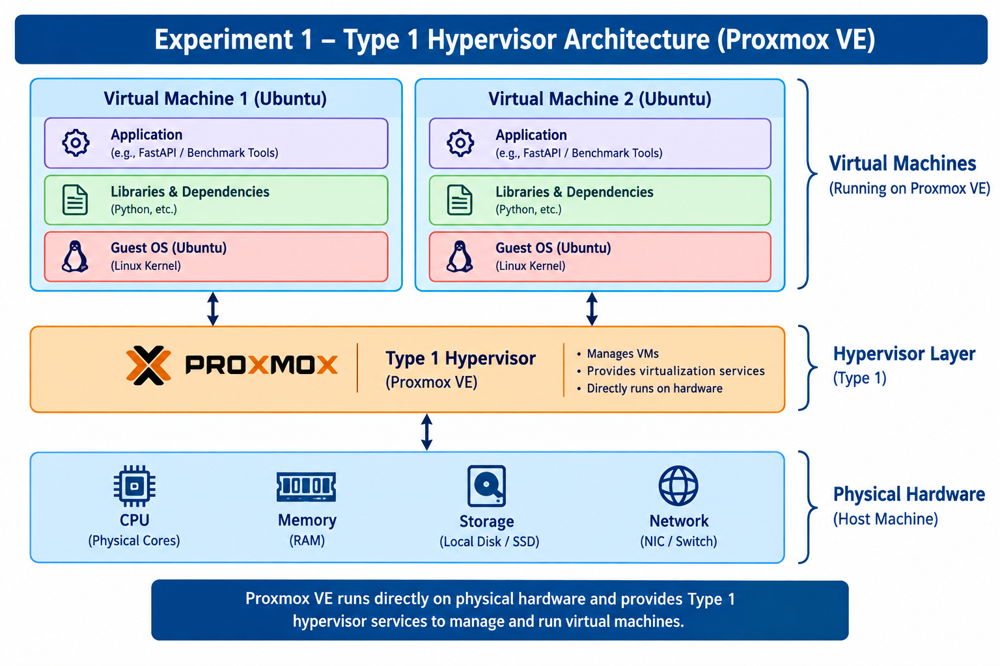
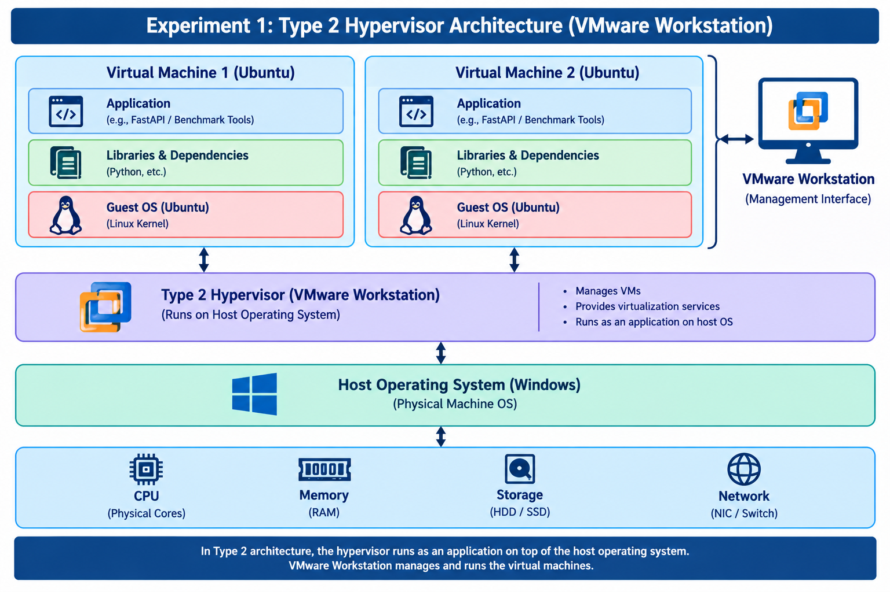
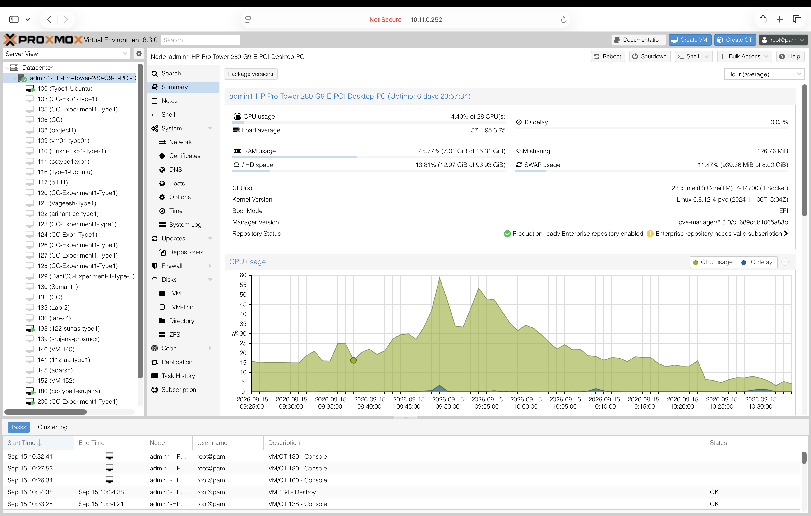
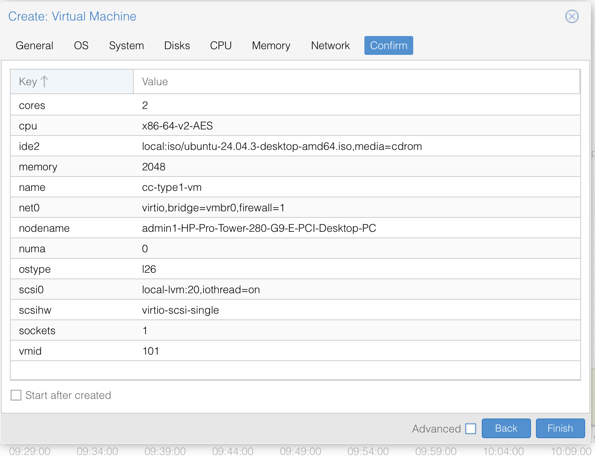
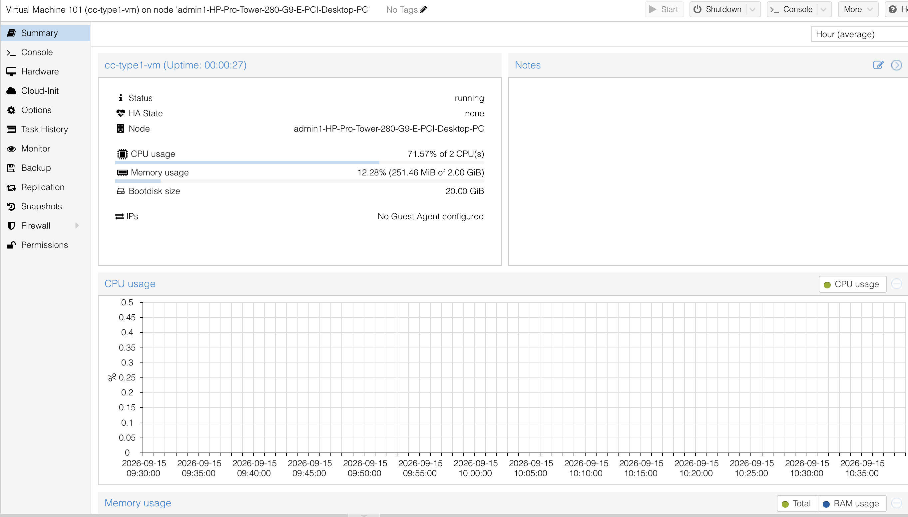
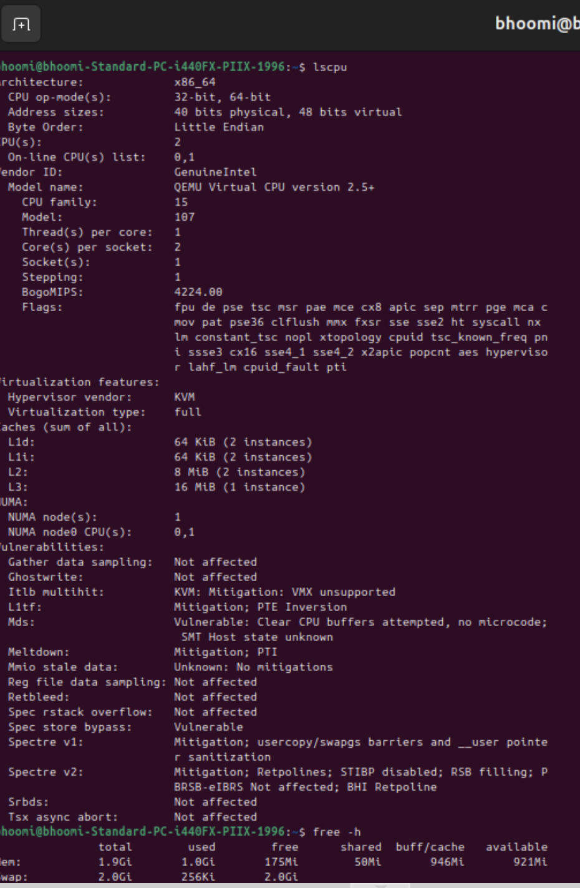
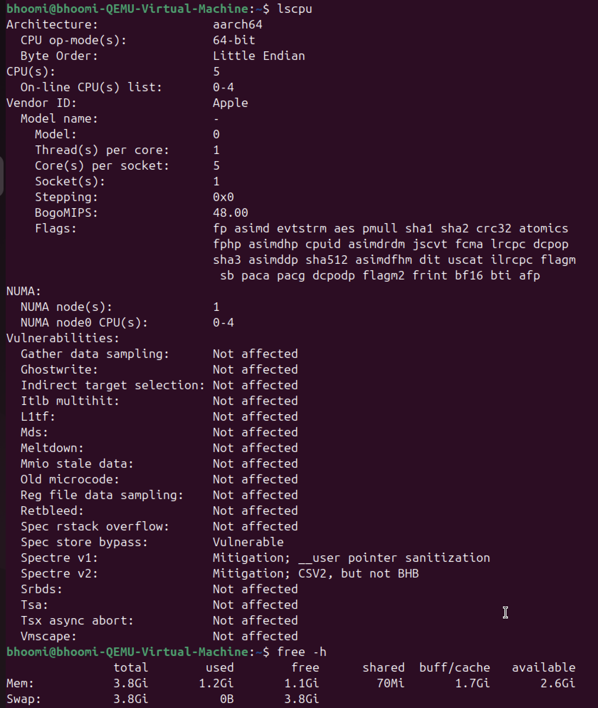
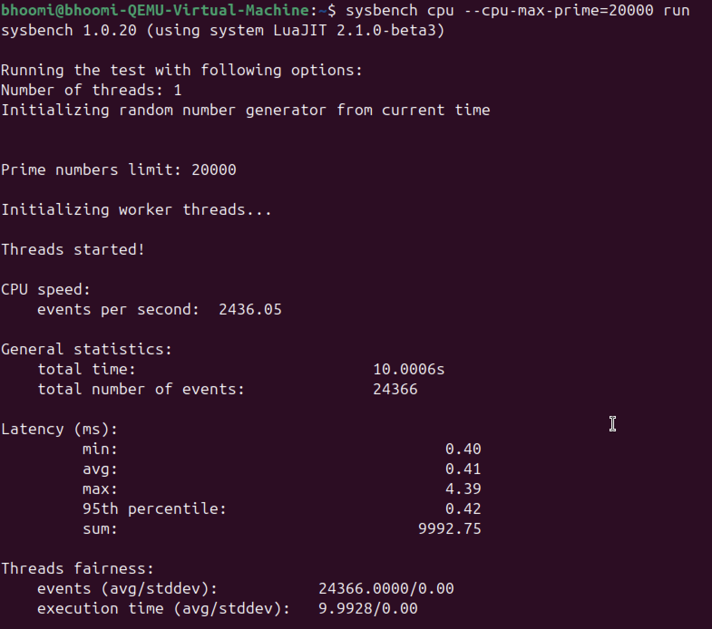

# Experiment 1: Hypervisor Analysis

## 1. Problem Statement

To study and analyze Type-1 and Type-2 hypervisors by creating and configuring virtual machines, understanding their architectures, verifying the virtualized environment, and performing basic CPU performance analysis.

The experiment uses **Proxmox VE** as the Type-1 hypervisor and **VMware Workstation** as the Type-2 hypervisor.

---

# 2. Objectives

1. To understand virtualization and the concept of hypervisors.
2. To study Type-1 and Type-2 hypervisor architectures.
3. To create and configure a virtual machine using Proxmox VE.
4. To create and configure a virtual machine using VMware Workstation.
5. To verify CPU, memory, and storage resources available to the virtual machine.
6. To perform CPU performance testing using Sysbench.
7. To record and compare the obtained performance results.

---

# 3. Requirements

## Hardware

* Computer or server capable of supporting virtualization.
* Sufficient CPU, RAM, and storage.
* Network connectivity where required.

## Software

| Software           | Purpose                |
| ------------------ | ---------------------- |
| Proxmox VE         | Type-1 Hypervisor      |
| VMware Workstation | Type-2 Hypervisor      |
| Ubuntu             | Guest Operating System |
| Sysbench           | CPU Benchmarking       |

---

# 4. Introduction to Hypervisors

A **hypervisor** is a software layer that enables multiple virtual machines to share the resources of a physical computer.

Hypervisors are broadly classified into two types:

### Type-1 Hypervisor

A Type-1 hypervisor runs directly on the physical hardware without requiring a conventional host operating system between the hardware and the hypervisor.

**Example used in this experiment:** Proxmox VE.

### Type-2 Hypervisor

A Type-2 hypervisor runs as an application on top of a host operating system and provides virtualization to guest virtual machines.

**Example used in this experiment:** VMware Workstation.

---

# 5. Architecture

## 5.1 Type-1 Hypervisor Architecture



### Architecture Flow

```text
Physical Hardware
        ↓
Proxmox VE
(Type-1 Hypervisor)
        ↓
Virtual Machine
        ↓
Ubuntu Guest OS
        ↓
Applications / Benchmark
```

In this architecture, Proxmox VE provides the virtualization layer directly above the physical hardware. Virtual machines are created and managed by the hypervisor.

---

## 5.2 Type-2 Hypervisor Architecture



### Architecture Flow

```text
Physical Hardware
        ↓
Host Operating System
        ↓
VMware Workstation
(Type-2 Hypervisor)
        ↓
Virtual Machine
        ↓
Ubuntu Guest OS
        ↓
Applications / Benchmark
```

In this architecture, VMware Workstation operates on top of the host operating system and provides the virtualization environment for the guest virtual machine.

---

# 6. Type-1 Hypervisor — Proxmox VE

## 6.1 Introduction

Proxmox VE is used as the Type-1 hypervisor in this experiment.

An Ubuntu virtual machine is created and configured in the Proxmox environment. The VM resources are verified and CPU performance is tested using Sysbench.

---

## 6.2 Configuration

| Parameter              | Configuration   |
| ---------------------- | --------------- |
| Hypervisor             | Proxmox VE      |
| Hypervisor Type        | Type-1          |
| Guest Operating System | Ubuntu          |
| Virtual CPU            | 2 vCPU          |
| Memory                 | 2 GB            |
| Virtual Disk           | 20 GB           |
| Network                | Virtual Network |
| Benchmark Tool         | Sysbench        |

> The VM configuration should be adjusted according to the resources available on the system used for the experiment.

---

## 6.3 Procedure

### Step 1: Access Proxmox

Open the Proxmox VE web interface and log in using the configured administrator credentials.

### Step 2: Create Virtual Machine

1. Select the required Proxmox node.
2. Select **Create VM**.
3. Enter a suitable VM name.
4. Select the Ubuntu ISO image.
5. Configure the operating system settings.
6. Configure the virtual disk.
7. Allocate CPU resources.
8. Allocate memory.
9. Configure the network adapter.
10. Review the configuration.
11. Create the virtual machine.

### Step 3: Start the VM

Start the newly created virtual machine and install Ubuntu.

### Step 4: Login

After installation, log in to the Ubuntu guest operating system.

### Step 5: Verify Resources

Verify the CPU, memory, storage, and operating system configuration using the commands given below.

---

## 6.4 System Verification Commands

### Operating System

```bash
hostnamectl
```

### CPU

```bash
lscpu
```

### Memory

```bash
free -h
```

### Storage

```bash
lsblk
```

```bash
df -h
```

### System Monitoring

```bash
top
```

---

## 6.5 Install Sysbench

Update the package information:

```bash
sudo apt update
```

Install Sysbench:

```bash
sudo apt install sysbench -y
```

Verify the installation:

```bash
sysbench --version
```

---

## 6.6 CPU Benchmark

Run the CPU benchmark:

```bash
sysbench cpu --cpu-max-prime=20000 run
```

The command performs a CPU workload and reports parameters such as execution time, number of events, events per second, and latency.

---

## 6.7 Type-1 Evidence

### Proxmox Dashboard



### Proxmox VM Configuration



### Ubuntu VM Running



### Ubuntu Console


### Proxmox System Configuration



These screenshots document the creation, execution, and configuration of the Ubuntu virtual machine in the Proxmox environment.

---

# 7. Type-2 Hypervisor — VMware Workstation

## 7.1 Introduction

VMware Workstation is used as the Type-2 hypervisor in this experiment.

An Ubuntu virtual machine is created and configured using VMware Workstation. The guest system is verified and CPU performance is measured using Sysbench.

---

## 7.2 Configuration

| Parameter              | Configuration      |
| ---------------------- | ------------------ |
| Hypervisor             | VMware Workstation |
| Hypervisor Type        | Type-2             |
| Host Operating System  | Windows            |
| Guest Operating System | Ubuntu             |
| Virtual CPU            | 2 vCPU             |
| Memory                 | 2 GB               |
| Virtual Disk           | 20 GB              |
| Network                | Virtual Network    |
| Benchmark Tool         | Sysbench           |

> The VM configuration should be adjusted according to the resources available on the system used for the experiment.

---

## 7.3 Procedure

### Step 1: Open VMware Workstation

Open VMware Workstation on the host operating system.

### Step 2: Create Virtual Machine

1. Select **Create a New Virtual Machine**.
2. Select the Ubuntu ISO image.
3. Select Linux/Ubuntu as the guest operating system.
4. Enter a suitable virtual machine name.
5. Configure the virtual disk.
6. Open the hardware configuration.
7. Allocate the required CPU.
8. Allocate the required memory.
9. Configure the network adapter.
10. Review the configuration.
11. Create the virtual machine.

### Step 3: Start the VM

Start the virtual machine and install Ubuntu.

### Step 4: Login

Log in to the Ubuntu guest operating system after installation.

### Step 5: Verify Resources

Verify the CPU, memory, storage, and operating system using the commands given below.

---

## 7.4 System Verification Commands

### Operating System

```bash
hostnamectl
```

### CPU

```bash
lscpu
```

### Memory

```bash
free -h
```

### Storage

```bash
lsblk
```

```bash
df -h
```

### System Monitoring

```bash
top
```

---

## 7.5 Install Sysbench

Update the package information:

```bash
sudo apt update
```

Install Sysbench:

```bash
sudo apt install sysbench -y
```

Verify the installation:

```bash
sysbench --version
```

---

## 7.6 CPU Benchmark

Run:

```bash
sysbench cpu --cpu-max-prime=20000 run
```

Record the benchmark output for performance analysis.

---

## 7.7 Type-2 Evidence

### VMware VM Configuration


### VMware VM Running


### VMware System Configuration



### VMware Sysbench Result



These screenshots document the creation, execution, configuration, and CPU benchmarking of the Ubuntu virtual machine in VMware Workstation.

---

# 8. Performance Analysis

The CPU benchmark results from the Type-1 and Type-2 environments can be compared using the measurements obtained from Sysbench.

The same benchmark command is used in both environments:

```bash
sysbench cpu --cpu-max-prime=20000 run
```

## Performance Parameters

| Parameter         |            Type-1: Proxmox |             Type-2: VMware |
| ----------------- | -------------------------: | -------------------------: |
| Total Time        | Refer to result screenshot | Refer to result screenshot |
| Total Events      | Refer to result screenshot | Refer to result screenshot |
| Events per Second | Refer to result screenshot | Refer to result screenshot |
| Average Latency   | Refer to result screenshot | Refer to result screenshot |

> The values should be taken directly from the benchmark output screenshots. No assumed or sample values are used.

---

# 9. Type-1 and Type-2 Comparison

| Feature                    | Type-1 Hypervisor             | Type-2 Hypervisor            |
| -------------------------- | ----------------------------- | ---------------------------- |
| Hypervisor                 | Proxmox VE                    | VMware Workstation           |
| Location of Hypervisor     | Directly on physical hardware | Above host operating system  |
| Host OS Dependency         | No conventional host OS       | Requires host OS             |
| Guest OS                   | Ubuntu                        | Ubuntu                       |
| Virtual Machine Management | Proxmox VE                    | VMware Workstation           |
| Experiment Performed       | VM creation and benchmarking  | VM creation and benchmarking |

---

# 10. Result

The experiment successfully demonstrated the use of both Type-1 and Type-2 hypervisors.

### Type-1

Proxmox VE was used to create and run an Ubuntu virtual machine. The VM configuration was verified and CPU performance was measured using Sysbench.

### Type-2

VMware Workstation was used to create and run an Ubuntu virtual machine. The VM configuration was verified and CPU performance was measured using Sysbench.

The obtained benchmark results can be used to compare the performance of the two virtualization environments.

---

# 11. Conclusion

This experiment provided practical understanding of virtualization and hypervisors.

Type-1 virtualization was studied using Proxmox VE, while Type-2 virtualization was studied using VMware Workstation. Ubuntu was used as the guest operating system in both environments.

The experiment also demonstrated VM configuration, resource verification, and CPU benchmarking using Sysbench.

---

# 12. Reproducibility Guide

A student referring to this experiment can reproduce it using the following procedure:

### Type-1 — Proxmox VE

1. Prepare a system capable of running Proxmox VE.
2. Install or access Proxmox VE.
3. Open the Proxmox web interface.
4. Create a new virtual machine.
5. Select an Ubuntu ISO.
6. Allocate CPU, memory, storage, and network resources.
7. Install Ubuntu.
8. Log in to the guest operating system.
9. Verify the system using `hostnamectl`, `lscpu`, `free -h`, `lsblk`, and `df -h`.
10. Install Sysbench.
11. Run the CPU benchmark.
12. Record the output.

### Type-2 — VMware Workstation

1. Prepare a system with VMware Workstation.
2. Open VMware Workstation.
3. Create a new virtual machine.
4. Select an Ubuntu ISO.
5. Allocate CPU, memory, storage, and network resources.
6. Install Ubuntu.
7. Log in to the guest operating system.
8. Verify the system configuration.
9. Install Sysbench.
10. Run the same CPU benchmark.
11. Record the output.
12. Compare the results with the Type-1 environment.

Using the same benchmark command and comparable VM resource configurations makes the experiment easier to reproduce.

---

# 13. Important Commands

### System Information

```bash
hostnamectl
```

```bash
lscpu
```

```bash
free -h
```

```bash
lsblk
```

```bash
df -h
```

### Sysbench

```bash
sudo apt update
```

```bash
sudo apt install sysbench -y
```

```bash
sysbench --version
```

```bash
sysbench cpu --cpu-max-prime=20000 run
```

---

# 14. Repository Structure

```text
01-Hypervisor-Analysis/
│
├── README.md
├── type-1.png
├── type-2.png
│
├── results/
│
└── screenshots/
    ├── 01-proxmox-dashboard.png
    ├── 02-proxmox-vm-configuration.png
    ├── 03-proxmox-vm-running.png
    ├── 04-proxmox-ubuntu-console.png
    ├── 05-proxmox-system-configuration.png
    ├── 01-vmware-vm-configuration.png
    ├── 02-vmware-vm-running.png
    ├── 03-vmware-system-configuration.png
    └── 04-vmware-sysbench-result.png
```

---

# 15. Author

**Name:** Shreenidhi

**Course:** Cloud Computing Lab
