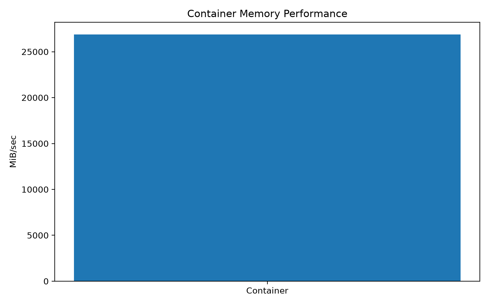

# Experiment 2 — VM vs Container Performance Analysis

## 1. Aim

To compare the performance of a Virtual Machine (VM) and a Docker container by evaluating CPU, memory, disk I/O, network performance, and application-level execution under the same experimental environment.

---

## 2. Objectives

1. To understand the difference between Virtual Machine and container-based virtualization.
2. To configure and verify the Virtual Machine environment used for the experiment.
3. To configure and verify the Docker container environment.
4. To measure CPU performance of the VM and container using benchmarking tools.
5. To compare memory and disk I/O performance between the VM and container.
6. To measure and compare network performance between the VM and container.
7. To observe application-level execution using a containerized FastAPI service and analyze the obtained results.

---

## 3. Introduction

Virtual Machines and containers are two commonly used approaches for deploying applications in cloud computing environments.

A Virtual Machine provides an isolated operating-system environment through a hypervisor. Each VM contains its own operating system and allocated virtual hardware resources.

Containers provide application-level isolation while sharing the host operating system kernel. Docker is used to create, run, and manage containers.

This experiment compares both approaches using measurable system and application performance parameters.

---

## 4. System Architecture

The experiment consists of two execution environments:

```text
                         VM vs Container
                               │
                ┌──────────────┴──────────────┐
                │                             │
        Virtual Machine                  Docker Container
                │                             │
        Ubuntu Environment             Container Environment
                │                             │
        ┌───────┼────────┐             ┌──────┼─────────┐
        │       │        │             │      │         │
       CPU    Memory    Disk          CPU   Memory     Disk
        │       │        │             │      │         │
        └───────┴────────┘             └──────┴─────────┘
                │                             │
                └──────────────┬──────────────┘
                               │
                         Network Testing
                               │
                            iperf3
                               │
                         Performance Data
                               │
                    ┌──────────┴──────────┐
                    │                     │
                 VM Result          Container Result
```

### Application-Level Architecture

```text
                         Client
                           │
                           ▼
                  Containerized FastAPI
                         Service
                           │
             ┌─────────────┴─────────────┐
             │                           │
          Health API                Compute API
             │                           │
             ▼                           ▼
       Service Response          Computation Result
```

The same experimental idea is used to observe how virtualization and containerization affect system and application performance.

---

## 5. Experimental Environment

### Virtual Machine Environment

| Parameter        | Configuration           |
| ---------------- | ----------------------- |
| Platform         | VMware Virtual Platform |
| Operating System | Ubuntu 24.04.5 LTS      |
| Kernel           | 7.0.0-31-generic        |
| CPU              | 2 virtual CPUs          |
| Memory           | Approximately 1.9 GiB   |
| Virtual Disk     | 20 GB                   |
| Swap             | Approximately 3.4 GiB   |

### Container Environment

| Parameter              | Configuration   |
| ---------------------- | --------------- |
| Container Runtime      | Docker          |
| Docker Version         | 29.1.3          |
| Base Image             | Ubuntu 24.04    |
| CPU Limit              | 1 CPU           |
| Memory Limit           | 512 MB          |
| Memory Limit in cgroup | 536870912 bytes |
| CPU Limit in cgroup    | 100000 / 100000 |

### Benchmark Tools

| Tool       | Purpose                           |
| ---------- | --------------------------------- |
| `sysbench` | CPU and system benchmarking       |
| `fio`      | Disk I/O benchmarking             |
| `iperf3`   | Network performance measurement   |
| Docker     | Container creation and management |
| FastAPI    | Application-level testing         |

---

## 6. Experimental Setup

The experiment was performed in an Ubuntu Virtual Machine.

The system configuration was first verified using standard Linux system-information commands. Docker was then configured and a container environment was created for comparison.

The container was configured with controlled resource limits so that the VM and container could be evaluated under a defined resource allocation.

### Container Resource Configuration

```text
CPU Limit    : 1 CPU
Memory Limit : 512 MB
```

The container resource limits were verified using Docker and Linux cgroup information.

---

## 7. Procedure

### Step 1 — Verify VM System Information

The VM operating system, CPU, memory, storage, kernel, and virtualization platform were verified.

Evidence:

* `02-lscpu-system-info.png`
* `03-memory-and-storage-info.png`
* `05-vm-configuration.png`

---

### Step 2 — Verify Docker Environment

Docker installation and configuration were verified before performing the container experiments.

Evidence:

* `04-disk-and-docker-info.png`
* `06-docker-configuration.png`

---

### Step 3 — Verify Docker Container Execution

A Docker container was created and basic Docker functionality was tested.

Evidence:

* `01-docker-hello-world.png`
* `08-benchmark-dockerfile.png`
* `09-benchmark-docker-image.png`
* `10-container-tools-verification.png`

---

### Step 4 — Perform CPU Benchmark

CPU performance was measured using `sysbench`.

The CPU benchmark was executed for the VM and the container and the measured results were recorded.

Evidence:

* `07-baseline-cpu-sysbench.png`
* `11-vm-cpu-result.png`
* `12-container-cpu-result.png`

---

### Step 5 — Perform Memory Benchmark

Memory performance was evaluated for the container environment.

Evidence:

* `13-container-memory-result.png`

---

### Step 6 — Perform Disk I/O Benchmark

Disk performance was evaluated using `fio`.

The experiment included:

* Sequential read
* Sequential write
* Random read
* Random write

Evidence:

* `14-vm-disk-results.png`
* `15-container-disk-results.png`

---

### Step 7 — Perform Network Benchmark

Network performance was measured using `iperf3`.

The VM and container network results were recorded and compared.

Evidence:

* `16-vm-network-iperf3.png`
* `17-container-network-iperf3.png`

---

### Step 8 — Test Application-Level Performance

A FastAPI-based application was used to verify application execution inside the container.

The application exposed endpoints for health checking and computation.

Evidence:

* `18-fastapi-health.png`
* `19-fastapi-compute.png`
* `20-fastapi-container-running.png`
* `21-container-fastapi-endpoints.png`

---

## 8. Benchmark Categories

The experiment evaluates the following performance parameters:

```text
                 Performance Analysis
                         │
       ┌─────────────────┼─────────────────┐
       │                 │                 │
      CPU              Memory             Disk
       │                 │                 │
   sysbench          Memory Test          fio
       │                 │                 │
       └─────────────────┼─────────────────┘
                         │
                      Network
                         │
                       iperf3
                         │
                  Application Test
                         │
                      FastAPI
```

---

## 9. CPU Performance

CPU performance was evaluated using `sysbench`.

The same benchmarking approach was applied to the VM and container environments.

### CPU Comparison

| Environment | Benchmark    | Result                         |
| ----------- | ------------ | ------------------------------ |
| VM          | Sysbench CPU | Measured value from experiment |
| Container   | Sysbench CPU | Measured value from experiment |

The actual benchmark screenshots are retained in the `screenshots` directory as experimental evidence.

---

## 10. Memory Performance

Memory behavior was examined under the configured container resource limit.

The container was restricted to approximately 512 MB of memory.

This demonstrates how containers can be given explicit resource limits using Docker.

### Memory Configuration

```text
Container Memory Limit = 512 MB
```

The measured result is available in:

```text
screenshots/13-container-memory-result.png
```

---

## 11. Disk I/O Performance

Disk performance was evaluated using `fio`.

The experiment included both sequential and random operations.

### Operations Tested

```text
Sequential Read
Sequential Write
Random Read
Random Write
```

VM results:

```text
screenshots/14-vm-disk-results.png
```

Container results:

```text
screenshots/15-container-disk-results.png
```

These measurements provide a basis for comparing storage I/O behavior in the two environments.

---

## 12. Network Performance

Network throughput was evaluated using `iperf3`.

The VM network test was performed separately from the container network test.

### VM Network Test

The measured VM network throughput was approximately:

```text
64–66 Gbit/s
```

### Container Network Test

The final container network test produced approximately:

```text
64.8 Gbit/s
```

Evidence:

* `16-vm-network-iperf3.png`
* `17-container-network-iperf3.png`

The values demonstrate the measured network throughput obtained during this experimental run.

---

## 13. Application-Level Testing

A FastAPI application was used to verify that an application can run successfully inside the container.

Two application-level operations were tested:

1. Health check
2. Compute operation

The container was started and the endpoints were accessed to verify successful execution.

Evidence:

* `18-fastapi-health.png`
* `19-fastapi-compute.png`
* `20-fastapi-container-running.png`
* `21-container-fastapi-endpoints.png`

---

## 14. Results

The experiment produced measurements for the following areas:

| Parameter             | VM       | Container |
| --------------------- | -------- | --------- |
| CPU                   | Measured | Measured  |
| Memory                | Measured | Measured  |
| Sequential Disk Read  | Measured | Measured  |
| Sequential Disk Write | Measured | Measured  |
| Random Disk Read      | Measured | Measured  |
| Random Disk Write     | Measured | Measured  |
| Network               | Measured | Measured  |
| Application Execution | Verified | Verified  |

The detailed measured values are supported by the screenshots collected during the experiment.

---

## 15. Performance Analysis

### CPU

CPU benchmarking was performed using the same benchmarking tool in both environments. The results can be compared to observe the effect of virtualization and containerization overhead.

### Memory

The container was given a controlled memory limit of 512 MB. This demonstrates that container resources can be explicitly restricted.

### Disk

Sequential and random disk operations were tested to observe storage performance under both environments.

### Network

Network throughput was measured using `iperf3`. The observed VM and container throughput values were close during the final measurements.

### Application

The FastAPI application successfully executed inside the container, demonstrating that containerized applications can provide working application endpoints while using controlled resources.

---

## 16. Observation

The experiment demonstrates the following observations:

1. Both VMs and containers can provide isolated execution environments for applications.
2. A VM provides a complete operating-system environment.
3. Containers share the host kernel and therefore use a different isolation model.
4. Docker allows explicit CPU and memory resource limits to be configured.
5. CPU, memory, disk, and network performance can be measured using standard benchmarking tools.
6. The measured network throughput of the VM and container was close in the final test.
7. The FastAPI application successfully executed inside the container.

All observations are based on the measurements and screenshots collected during this experiment.

---

## 17. Experimental Evidence

All experiment screenshots are stored in the `screenshots` directory.

### System and Configuration

* `01-docker-hello-world.png`
* `02-lscpu-system-info.png`
* `03-memory-and-storage-info.png`
* `04-disk-and-docker-info.png`
* `05-vm-configuration.png`
* `06-docker-configuration.png`

### Container and Benchmark Setup

* `07-baseline-cpu-sysbench.png`
* `08-benchmark-dockerfile.png`
* `09-benchmark-docker-image.png`
* `10-container-tools-verification.png`

### CPU and Memory

* `11-vm-cpu-result.png`
* `12-container-cpu-result.png`
* `13-container-memory-result.png`

### Disk

* `14-vm-disk-results.png`
* `15-container-disk-results.png`

### Network

* `16-vm-network-iperf3.png`
* `17-container-network-iperf3.png`

### Application

* `18-fastapi-health.png`
* `19-fastapi-compute.png`
* `20-fastapi-container-running.png`
* `21-container-fastapi-endpoints.png`

---

## 18. Conclusion

The experiment successfully evaluated VM and container environments using CPU, memory, disk I/O, network, and application-level tests.

The VM environment was configured and verified, while Docker was used to create a controlled container environment. Benchmarking tools such as `sysbench`, `fio`, and `iperf3` were used to obtain measurable performance results.

The FastAPI application was also successfully executed inside the container, confirming application-level functionality.

The experiment provides a practical comparison of VM-based and container-based execution environments and demonstrates how resource configuration and benchmarking can be used to analyze cloud computing performance.

---

## 19. Repository Structure

```text
02-VM-Container-Performance/
│
├── README.md
│
├── screenshots/
│   ├── 01-docker-hello-world.png
│   ├── 02-lscpu-system-info.png
│   ├── 03-memory-and-storage-info.png
│   ├── 04-disk-and-docker-info.png
│   ├── 05-vm-configuration.png
│   ├── 06-docker-configuration.png
│   ├── 07-baseline-cpu-sysbench.png
│   ├── 08-benchmark-dockerfile.png
│   ├── 09-benchmark-docker-image.png
│   ├── 10-container-tools-verification.png
│   ├── 11-vm-cpu-result.png
│   ├── 12-container-cpu-result.png
│   ├── 13-container-memory-result.png
│   ├── 14-vm-disk-results.png
│   ├── 15-container-disk-results.png
│   ├── 16-vm-network-iperf3.png
│   ├── 17-container-network-iperf3.png
│   ├── 18-fastapi-health.png
│   ├── 19-fastapi-compute.png
│   ├── 20-fastapi-container-running.png
│   └── 21-container-fastapi-endpoints.png
│
└── results/
    ├── figures/
    ├── data/
    └── scripts/
```

---

## 20. Final Experimental Workflow

```text
SYSTEM SETUP
     ↓
VM CONFIGURATION
     ↓
DOCKER CONFIGURATION
     ↓
CONTAINER CREATION
     ↓
CPU BENCHMARK
     ↓
MEMORY BENCHMARK
     ↓
DISK I/O BENCHMARK
     ↓
NETWORK BENCHMARK
     ↓
FASTAPI APPLICATION TEST
     ↓
RESULT COLLECTION
     ↓
PERFORMANCE ANALYSIS
     ↓
CONCLUSION
```

---

## 21. Final Deliverables

The completed experiment contains:

* Experiment documentation
* VM configuration evidence
* Docker configuration evidence
* Container setup evidence
* CPU benchmark results
* Memory benchmark results
* Disk I/O results
* Network benchmark results
* FastAPI application testing
* 21 experimental screenshots
* Performance analysis
* Conclusion
* Organized GitHub repository structure

---

## 17. Performance Graphs

### CPU Performance

The CPU benchmark results obtained from the VM and container environments are shown below.


### Network Throughput

The network throughput measured using `iperf3` is compared below.


### Container Memory Performance

The measured container memory performance is shown below.



### Benchmark Data

The numerical benchmark values used to generate the graphs are stored in:

`results/processed/benchmark_results.csv`

The graph-generation script is stored in:

`results/processed/generate_graphs.py`


## Author

**Name:** Shreenidhi Dharwad

**Course:** Cloud Computing

**Institution:** KLE Technological University

**Academic Year:** 2026
