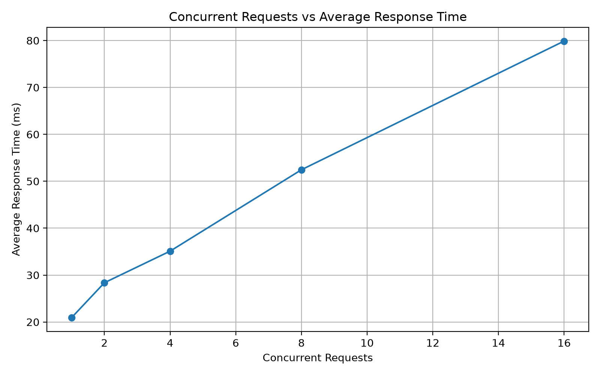
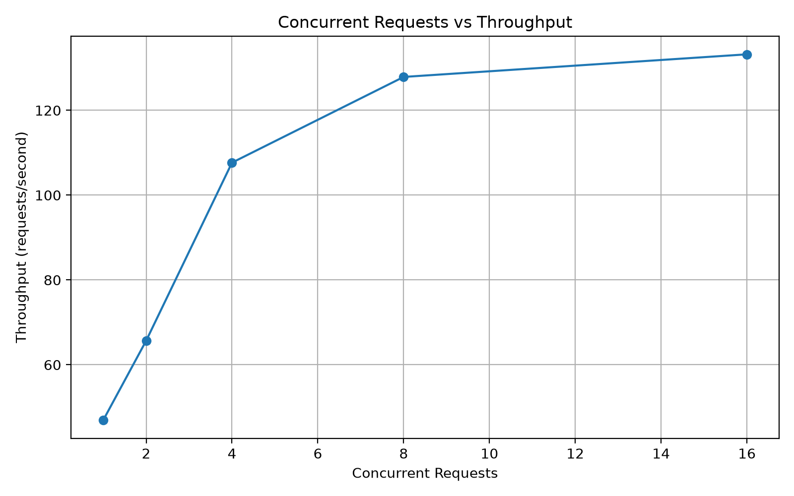
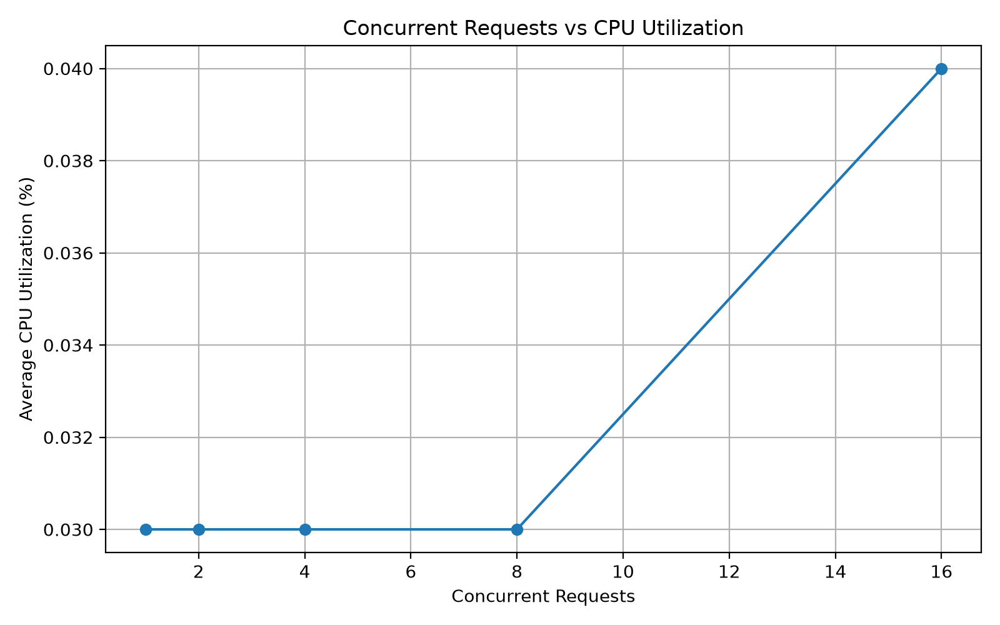
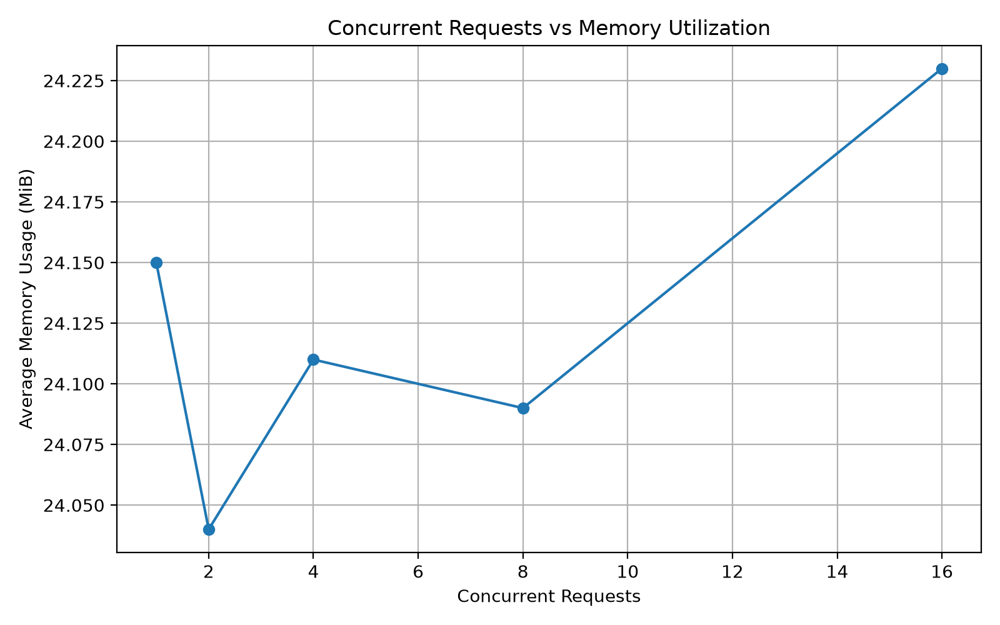

# Hospital Management System using Microservices and Docker

## 1. Project Overview

This project implements a small **Hospital Management System** using a **microservices architecture**.

The application is divided into three independent services:

* **Patient Service** – manages patient information.
* **Doctor Service** – manages doctor information.
* **Appointment Service** – manages appointments and communicates with the Patient and Doctor services.

The services are containerized using **Docker** and connected through a Docker bridge network using **Docker Compose**.

---

## 2. Problem Statement

Design and implement a small cloud-based application using a microservices architecture and containerization.

The system should demonstrate:

* Independent microservices
* Containerization using Docker
* Communication between services
* Service orchestration using Docker Compose
* Workload testing under different concurrency levels
* Measurement of response time, throughput, CPU utilization, and memory utilization

---

## 3. Objectives

The main objectives of the project are:

1. To implement a hospital management application using microservices.
2. To separate application functionality into independent services.
3. To containerize each service using Docker.
4. To enable communication between microservices using Docker service names.
5. To orchestrate multiple containers using Docker Compose.
6. To evaluate the system under different workload levels.
7. To measure response time, throughput, CPU utilization, and memory utilization.

---

## 4. System Architecture

The system consists of three microservices:

```text
                    Client
                      |
                      v
             Appointment Service
                  Port 5003
                  /       \
                 /         \
                v           v
       Patient Service   Doctor Service
          Port 5001         Port 5002
```

All three services are connected through the Docker network:

```text
hospital-network
       |
       +----------------------+
       |          |           |
       v          v           v
 patient      doctor     appointment
 service      service       service
```

The Appointment Service communicates with:

```text
http://patient-service:5001
http://doctor-service:5002
```

and does not depend on `localhost` for inter-container communication.

---

## 5. Microservices

### 5.1 Patient Service

**Port:** 5001

The Patient Service provides patient information.

Example endpoint:

```text
GET /patients/1
```

Example response:

```json
{
    "id": 1,
    "name": "Rahul",
    "age": 25,
    "gender": "Male"
}
```

---

### 5.2 Doctor Service

**Port:** 5002

The Doctor Service provides doctor information.

Example endpoint:

```text
GET /doctors/1
```

Example response:

```json
{
    "id": 1,
    "name": "Dr. Ashok Dharwad",
    "specialization": "Gastroenterologist"
}
```

---

### 5.3 Appointment Service

**Port:** 5003

The Appointment Service manages appointment information.

Example endpoint:

```text
GET /appointments/1
```

The Appointment Service communicates with the Patient Service and Doctor Service and combines their responses.

Example response structure:

```json
{
    "appointment": {
        "id": 1,
        "patient_id": 1,
        "doctor_id": 1,
        "date": "2026-10-03",
        "time": "10:00 AM",
        "status": "Confirmed"
    },
    "patient": {
        "id": 1,
        "name": "Rahul",
        "age": 25,
        "gender": "Male"
    },
    "doctor": {
        "id": 1,
        "name": "Dr. Ashok Dharwad",
        "specialization": "Gastroenterologist"
    }
}
```

---

## 6. Technology Stack

| Technology            | Purpose                     |
| --------------------- | --------------------------- |
| Python                | Application development     |
| Flask                 | REST API development        |
| Requests              | Inter-service communication |
| Docker                | Containerization            |
| Docker Compose        | Service orchestration       |
| Docker Bridge Network | Microservice communication  |
| PowerShell            | Testing and execution       |
| Matplotlib            | Performance graphs          |

---

## 7. Project Structure

```text
03-Hospital-Management-Microservices/
│
├── patient-service/
│   ├── app.py
│   ├── Dockerfile
│   └── requirements.txt
│
├── doctor-service/
│   ├── app.py
│   ├── Dockerfile
│   └── requirements.txt
│
├── appointment-service/
│   ├── app.py
│   ├── Dockerfile
│   └── requirements.txt
│
├── graphs/
│   ├── 01-response-time.png
│   ├── 02-throughput.png
│   ├── 03-cpu-utilization.png
│   └── 04-memory-utilization.png
│
├── docker-compose.yml
├── workload_test.py
├── workload_monitor.py
├── workload_results.csv
├── generate_graphs.py
└── README.md
```

---

## 8. Containerization

Each microservice has its own Dockerfile.

The services are built using Docker Compose:

```powershell
docker compose build
```

The three services are then started using:

```powershell
docker compose up -d
```

The running containers can be checked using:

```powershell
docker compose ps
```

The three containers are:

```text
patient-service
doctor-service
appointment-service
```

---

## 9. Docker Network

The services communicate through the Docker bridge network:

```text
hospital-network
```

The Docker Compose configuration connects all three services to this network.

The Appointment Service accesses the other services using their Docker service names:

```text
patient-service:5001
doctor-service:5002
```

This demonstrates communication between independently containerized microservices.

---

## 10. End-to-End Communication

The end-to-end request was tested using:

```powershell
curl http://localhost:5003/appointments/1
```

The request successfully returned:

* Appointment information
* Patient information
* Doctor information

The response returned HTTP status:

```text
200 OK
```

This demonstrates successful communication between the three microservices.

---

## 11. Workload Testing

Five workload levels were tested as required:

| Workload | Concurrent Requests |
| -------- | ------------------: |
| W1       |                   1 |
| W2       |                   2 |
| W3       |                   4 |
| W4       |                   8 |
| W5       |                  16 |

Each workload level generated **20 requests**.

The following parameters were measured:

* Successful requests
* Failed requests
* Average response time
* Throughput
* Average CPU utilization
* Average memory utilization

---

## 12. Workload Results

The final measured results are:

| Workload | Concurrent Requests | Success | Failed | Avg Response Time (ms) | Throughput (req/s) | CPU Avg (%) | Memory Avg (MiB) |
| -------- | ------------------: | ------: | -----: | ---------------------: | -----------------: | ----------: | ---------------: |
| W1       |                   1 |      20 |      0 |                  20.93 |              46.95 |        0.03 |            24.15 |
| W2       |                   2 |      20 |      0 |                  28.37 |              65.68 |        0.03 |            24.04 |
| W3       |                   4 |      20 |      0 |                  35.10 |             107.66 |        0.03 |            24.11 |
| W4       |                   8 |      20 |      0 |                  52.45 |             127.87 |        0.03 |            24.09 |
| W5       |                  16 |      20 |      0 |                  79.88 |             133.20 |        0.04 |            24.23 |

---

## 13. Performance Graphs

### 13.1 Concurrent Requests vs Average Response Time



The average response time increased as the number of concurrent requests increased.

---

### 13.2 Concurrent Requests vs Throughput



Throughput increased as concurrency increased, with the measured throughput reaching 133.20 requests per second at 16 concurrent requests.

---

### 13.3 Concurrent Requests vs CPU Utilization



The measured average CPU utilization remained low across the tested workload levels.

---

### 13.4 Concurrent Requests vs Memory Utilization



The measured average memory usage remained approximately stable across the tested workload levels.

---

## 14. Performance Analysis

### Response Time

The average response time increased from:

```text
20.93 ms at W1
```

to:

```text
79.88 ms at W5
```

This shows that response time increased as concurrent requests increased.

### Throughput

The measured throughput increased from:

```text
46.95 requests/second at W1
```

to:

```text
133.20 requests/second at W5
```

### Success and Failure

All workload levels completed successfully.

Total requests:

```text
5 workload levels × 20 requests = 100 requests
```

Successful requests:

```text
100
```

Failed requests:

```text
0
```

### CPU Utilization

Average CPU utilization ranged from:

```text
0.03% to 0.04%
```

during the recorded workload measurements.

### Memory Utilization

Average memory usage remained approximately between:

```text
24.04 MiB and 24.23 MiB
```

across the five workload levels.

---

## 15. How to Run the Project

### Step 1: Open the project directory

```powershell
cd "03-Hospital-Management-Microservices"
```

### Step 2: Build the containers

```powershell
docker compose build
```

### Step 3: Start the services

```powershell
docker compose up -d
```

### Step 4: Check running containers

```powershell
docker compose ps
```

### Step 5: Test the Patient Service

```powershell
curl http://localhost:5001/patients/1
```

### Step 6: Test the Doctor Service

```powershell
curl http://localhost:5002/doctors/1
```

### Step 7: Test the Appointment Service

```powershell
curl http://localhost:5003/appointments/1
```

### Step 8: Run workload testing

```powershell
python workload_monitor.py
```

### Step 9: Generate graphs

```powershell
python generate_graphs.py
```

---

## 16. Conclusion

The Hospital Management System was implemented using a microservices architecture with three independently containerized Flask services.

Docker Compose was used to build, start, and manage the services, while a Docker bridge network enabled communication between the microservices using service names.

The Appointment Service successfully communicated with the Patient and Doctor services and produced a combined end-to-end response.

The workload evaluation was performed using five concurrency levels: 1, 2, 4, 8, and 16 concurrent requests. Across the 100 tested requests, all requests were successful.

The performance measurements demonstrate the effect of increasing concurrency on response time and throughput while also recording CPU and memory utilization.

Overall, the project demonstrates microservice decomposition, containerization, service-to-service communication, orchestration, workload testing, monitoring, and performance analysis.
