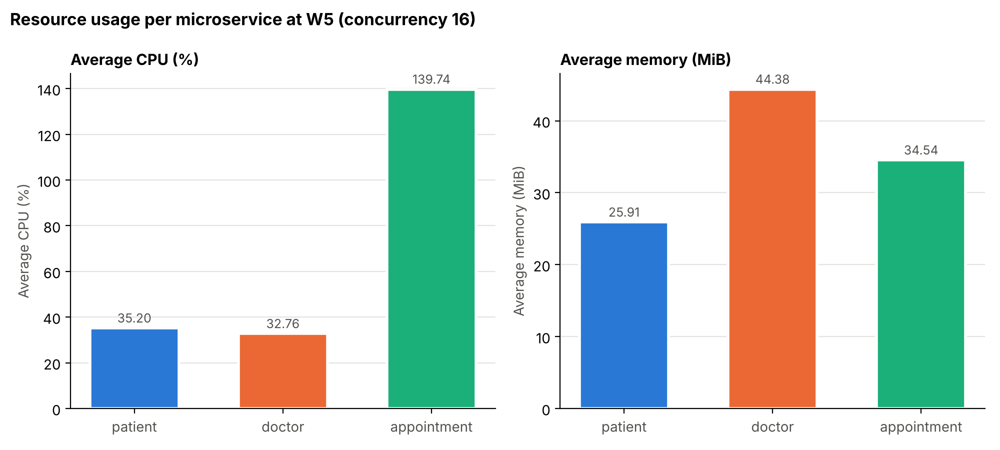

# Measured Results

_This file is generated by `generate_report.py` from the CSV files in `results/`. Do not edit the numbers by hand - re-run the benchmark instead._

## Test set-up

- **Date of run:** 2026-10-05T01:52:20
- **Endpoint under test:** `GET http://127.0.0.1:5003/appointments/1` (end-to-end: appointment-service -> patient-service + doctor-service)
- **Concurrency levels:** 1, 2, 4, 8, 16
- **Each run:** at least 500 requests and at least 10 s
- **Repetitions per level:** 3 (results below are the mean)
- **Warm-up:** 50 requests before measuring (discarded)
- **Load model:** closed loop: N worker threads, each sends the next request as soon as the previous response arrives
- **Throughput:** successful requests / wall-clock duration of run
- **Machine:** Windows-11-10.0.26200-SP0, 12 logical CPUs, Docker 29.8.0, Python 3.13.14
- **CPU %:** from `docker stats`, 100 % = one full CPU core. Sampled about once per second during each run.

## Observation table

| Workload | Concurrency | Requests | Avg response time (ms) | p95 (ms) | Throughput (req/s) | Failed | CPU avg, all 3 services (%) | Memory avg, all 3 services (MiB) |
|---|---:|---:|---:|---:|---:|---:|---:|---:|
| Idle | 0 | 0 | - | - | - | - | 15.46 | 102.39 |
| W1 | 1 | 1500 | 24.11 ± 2.54 | 40.66 | 41.65 ± 4.29 | 0 | 54.73 | 102.57 |
| W2 | 2 | 2398 | 25.03 ± 1.69 | 43.79 | 79.86 ± 5.52 | 0 | 96.56 | 103.54 |
| W3 | 4 | 3827 | 31.37 ± 1.72 | 46.65 | 127.27 ± 7.12 | 0 | 172.07 | 103.38 |
| W4 | 8 | 3959 | 61.19 ± 7.19 | 85.88 | 131.42 ± 14.61 | 0 | 200.38 | 104.19 |
| W5 | 16 | 4132 | 116.74 ± 3.62 | 147.01 | 136.51 ± 4.19 | 0 | 207.70 | 104.83 |

`±` = standard deviation across the repetitions. Requests = total over all repetitions.

## Resource usage per microservice

| Workload | Conc. | patient CPU avg / peak (%) | doctor CPU avg / peak (%) | appointment CPU avg / peak (%) | patient Mem avg / peak (MiB) | doctor Mem avg / peak (MiB) | appointment Mem avg / peak (MiB) |
|---|---:|---:|---:|---:|---:|---:|---:|
| Idle | 0 | 0.02 / 0.02 | 5.61 / 44.78 | 9.83 / 33.17 | 25.40 / 25.40 | 44.15 / 44.27 | 32.84 / 42.09 |
| W1 | 1 | 11.05 / 56.67 | 10.58 / 56.50 | 33.10 / 76.10 | 25.66 / 26.10 | 44.21 / 44.70 | 32.69 / 34.35 |
| W2 | 2 | 17.71 / 20.72 | 18.90 / 52.75 | 59.94 / 84.52 | 25.75 / 26.42 | 44.66 / 55.88 | 33.13 / 41.48 |
| W3 | 4 | 31.11 / 66.28 | 30.35 / 33.06 | 110.61 / 120.15 | 25.79 / 26.17 | 44.43 / 45.04 | 33.15 / 34.38 |
| W4 | 8 | 33.96 / 85.86 | 33.84 / 72.69 | 132.58 / 140.98 | 25.83 / 26.48 | 44.73 / 53.70 | 33.63 / 34.72 |
| W5 | 16 | 35.20 / 86.80 | 32.76 / 35.27 | 139.74 / 167.10 | 25.91 / 26.40 | 44.38 / 44.82 | 34.54 / 44.05 |

## Observations (computed from the data)

1. **Response time:** average response time went from **24.11 ms** at concurrency 1 to **116.74 ms** at concurrency 16 (4.8x). p95 went from 40.66 ms to 147.01 ms.
2. **Throughput:** went from **41.65 req/s** at concurrency 1 to **136.51 req/s** at concurrency 16. The highest value was 136.51 req/s at concurrency 16.
3. **Saturation:** going from concurrency 4 to 8 changed throughput by only +3.3 % while average response time changed by +95.0 %. Throughput levels off between concurrency 4 and 8: beyond that the application cannot complete requests any faster, so extra concurrent requests mostly wait in a queue, which shows up as higher response time.
4. **Consistency check (Little's law, N = X x R):** c=1: 41.6 req/s x 0.0241 s = 1.00; c=2: 79.9 req/s x 0.0250 s = 2.00; c=4: 127.3 req/s x 0.0314 s = 3.99; c=8: 131.4 req/s x 0.0612 s = 8.04; c=16: 136.5 req/s x 0.1167 s = 15.94. Each product is within 20 % of the concurrency level, so the measured response times and throughputs are consistent.
5. **Failures:** all 15816 measured requests succeeded (0 failed).
6. **Highest CPU user:** at concurrency 16, **appointment-service** used the most CPU: patient-service 35.20 %, doctor-service 32.76 %, appointment-service 139.74 % (4.1x the average of the other two).
7. **Memory:** at concurrency 16, **doctor-service** had the highest memory: patient-service 25.91 MiB, doctor-service 44.38 MiB, appointment-service 34.54 MiB. Most of this is each container's starting footprint, already present when idle. The part caused by the load is the increase from idle: patient-service +0.51 MiB, doctor-service +0.24 MiB, appointment-service +1.70 MiB, so **appointment-service** had the largest load-related memory increase.
8. **Load vs idle:** total CPU of the three containers rose from 15.46 % when idle to 207.70 % at concurrency 16. Total memory changed from 102.39 MiB to 104.83 MiB (+2.44 MiB).

## Graphs

### Concurrency vs Response Time

### Concurrency vs Throughput

### Concurrency vs CPU Utilization (per service)

### Concurrency vs Memory Usage (per service)

### Resource usage per microservice at highest load

